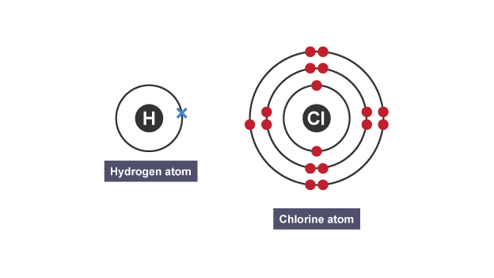
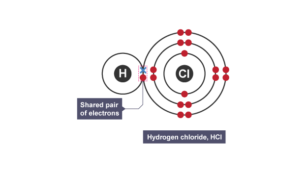

# Covalent Bonding

- Covalent bond - shared pair of electrons
- Molecule - two or more atoms bonded together by covalent bonds

## What is a Covalent Bond?

- When 2 non-metals react, both want to gain electrons to make a full outer shell
- They do this by sharing electrons

## Dot and Cross Diagrams

