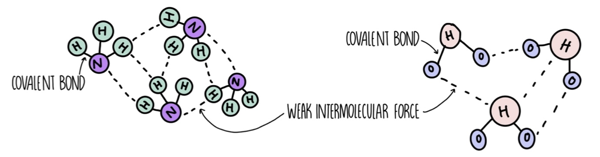

# Covalent Properties

## Simple Covalent Molecules

- Strong covalent bonds between atoms in the molecule
- Weak intermolecular forces between each of the molecules

### Properties

- Low melting and boiling points due to weak intermolecular forces between molecules
- Poor conductors of electricity as there are no delocalised electrons to carry charge
- They are insoluable as they have strong covalent bonds

## Giant Covalent Structures

- Some covalent structures are known as giant covalent structures
- These type of structures are made of a huge number of atoms and have strong covalent bonds between the atoms forming giant lattices

## Polymers

- A type of covalent molecule
- Made of long chains of carbon atoms, held by covalent bonds
- Polymers contain tens of thousands of atoms, arranged in repeating units
- The units are simple covalent molecules
- Repeating units are called monomers
- In a single polymer chain, there are often thousands of repeating units
