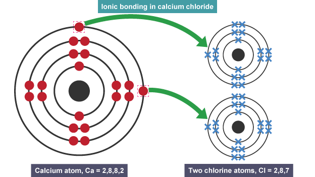
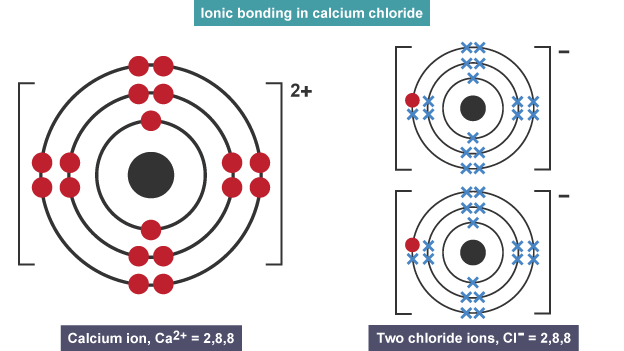

# Ionic Bonding

- Atoms that have lost electrons are cations (positive charge)
- Atoms that have gained electrons are anions (negative charge)
- Metals always forms cations
- Non-metals always forms anions

## Dot and Cross Diagram

