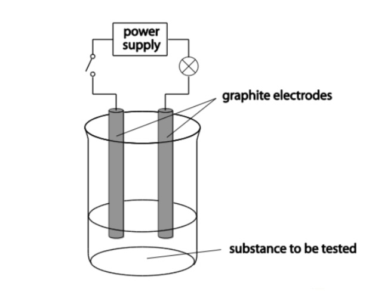

# Ionic Properties

## Giant Ionic Lattice

- Ionic compounds found in giant ionic lattices
- Giant 3D structures made of millions of alternating ions
- Positive cations will be found to negative anions in opposite and alternating 3D pattern
- Ions are held together by:
	- Strong ionic bonds
		- Happens due to electrostatic forces of attraction between cations and anions

## Properties of Ionic Substances

### High melting and boiling points

- Ionic bonds are attracted with strong forces of electrostatic attraction between cations and anions
- In order to melt the substance, a high amount of energy must be applied to break the bonds

### Brittle

- When a force is applied, the ions shift
- When the ions shift, they will be rearranged where it is not alternating
- The same type of ion will repel each other and break

### Insulator as Solids

- In a solid, the ions are held in a lattice therefore they cannot move
- All electrons involved in bonding

### Conductor as Liquids

- When molten/dissolved, the ions are no longer in the lattice and are free to move
- Ions can carry a charge now

### Crystalline

- Alternative cations and anions are arranged in an orderly way in a giant ionic lattice
- As this is so regular on a microscopic scale, it will be the same on a macroscopic scale

## Practical to find out Ionic Substances

### Health and safety

- Eye protection to be used
- Toxic fumes may be produced so do not keep the circuit connected for too long
- Toxic gases may be produced, once observations have been made, swwitch off the circuit

### Method

- Set up the equipment as shown in the diagram

- Choose a test substance and add some to boiling tube
- Add water to the boiling tube to about half full
- Seal the boiling tube using a bung
- Hold your thumb over the bung and shake the boiling tube
- Observe and record if the substance dissolves
	- If the substance dissolves add to beaker
	- Observe and record whether the lamps light or not.
		- If both tests suceed, the substance is ionic
	- After recording results, empty the beaker and clean apparatus of impurites
- Repeat the steps with remaining substances
