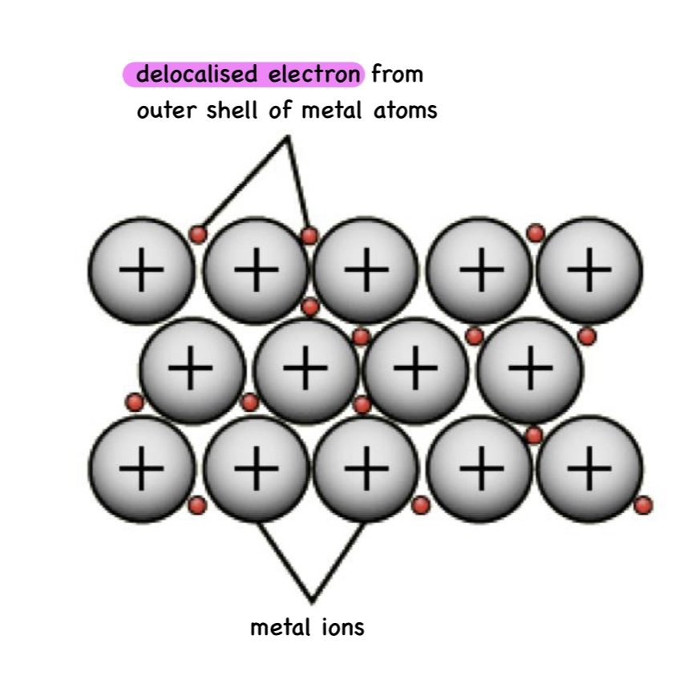

# Metallic Bonding

## Properties of a Metal

- Sonorous
- Ductile
- Shiny
- Malleable
	- when rearranged oppositely charged cations and anions still attract
- Conducts electricity
	- delocalised electrons
- Hard
- High tensile strength
- High melting point
- Conducts heat

## Metallic Structure

- Delocalised - free

- Metallic bonding is the electrostatic attraction between the metal cations and the delocalised electrons
- The ions are arranged in a lattice
- The delocalised electrons can carry charge
