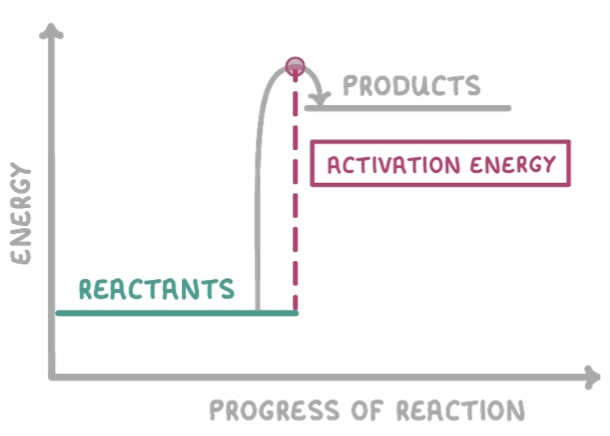

# Endothermic Reactions

## What is an endothermic reaction?

- An endothermic change/reaction is one in which heat energy is taken from the surroundings
- Energy is transferred from thermal to chemical
- This means the energy in the surroundings is lower
- The temperature of the surroundings will decrease

## What is activation energy

- Minimum amount of energy required for a reaction to occur
