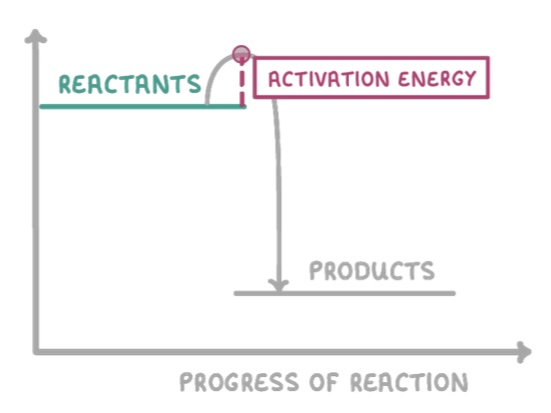

# Exothermic Reactions

- Chemical reactions - typically an irreversible reaction which makes something. Products cannot return to reactants

## What is an exothermic reaction?

- An exothermic change/reaction is one in which heat energy is given out to the surroundings
- Energy is transferred from chemical to thermal
- This means the energy in the surroundings is higher
- The temperature of the surroundings will increase

## What is activation energy

- Minimum amount of energy required for a reaction to occur
